# CRIM Thesaurus of Musical Types
Updated April 2025

# Table of Contents

* [CRIM Thesaurus of Musical Types](#crim-thesaurus-of-musical-types)
* [Cantus Firmus](#cantus-firmus)
* [Soggetto](#soggetto)
* [Counter Soggetto](#counter-soggetto)
* [Contrapuntal Duo](#contrapuntal-duo)
* [Schubert's Presentation Types in Brief](#schuberts-presentation-types-in-brief)
* [Fuga](#fuga)
* [Imitative Duos](#imitative-duos)
* [Periodic Entries](#periodic-entries)
* [Non-Imitative Duos](#non-imitative-duos)
* [Cadences](#cadences)
* [Homorhythm](#homorhythm)
---

## Cantus Firmus

A **cantus firmus** is a melody cited in its integrity by a single voice throughout a complete section of music.

In analysis and data entry, the CF can be characterized by:

* voice (by staff number)
* Select “pitches only” or “rhythms only” or ‘pitches and rhythms”

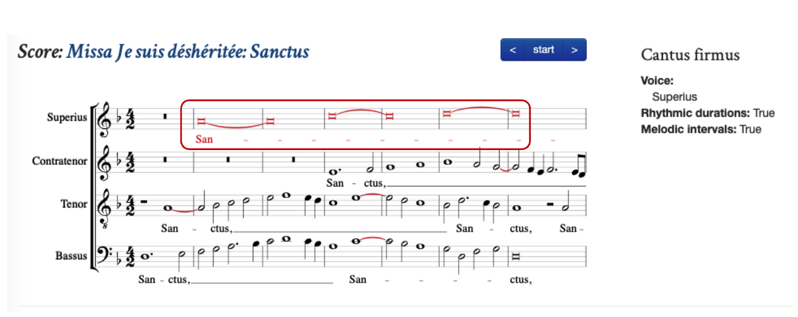

[CRIM Observation 1792](https://crimproject.org/observations/1792/)

---

## Soggetto

A **soggetto** (subject, motif) is a single line, considered as a totality. 

It can be any length, from a short motive to a phrase.  A plainchant melody is a soggetto, no less than a motive or phrase from a mensural composition.

Modifiers include (these are *mutually exclusive*):

* ***ostinato repetition*** (regular repetition of pitches and/or rhythm)
* ***periodic phrasing*** (sections of regular length, with or without repeating content within them)

In analysis and data entry, the soggetto can be characterized by:

* **a single voice** (by staff number)
* Note: If the given soggetto is part of a fuga, we only mark the fuga.  It is understood that a fuga *must* consist of repeated statements of a soggetto
* Select “**pitches only**” or “**rhythms only**” or ‘**pitches and rhythms**”

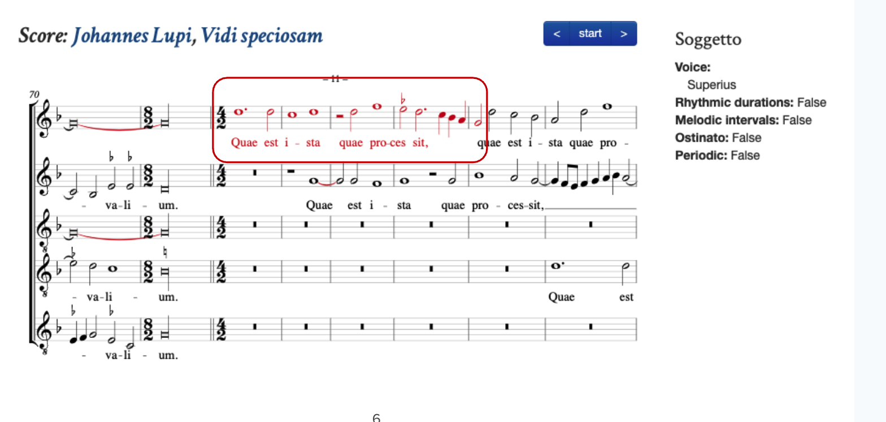

[CRIM Observation 573](https://crimproject.org/observations/573/)

---

## Counter Soggetto

A **counter soggetto** (subject, motif) is a single line, considered as a totality. 

It can be any length, from a short motive to a phrase.  A plainchant melody is a soggetto, no less than a motive or phrase from a mensural composition.

Modifiers include (these are *mutually exclusive*):

* ***ostinato repetition*** (regular repetition of pitches and/or rhythm)
* ***periodic phrasing*** (sections of regular length, with or without repeating content within them)

In analysis and data entry, the counter soggetto can be characterized by:

* **a single voice**(by staff number)
* Note: If the given soggetto is part of a fuga, we *only mark the fuga*.  It is understood that a fuga *must* consist of repeated statements of a soggetto
* Select “**pitches only**” or “**rhythms only**” or ‘**pitches and rhythms**”

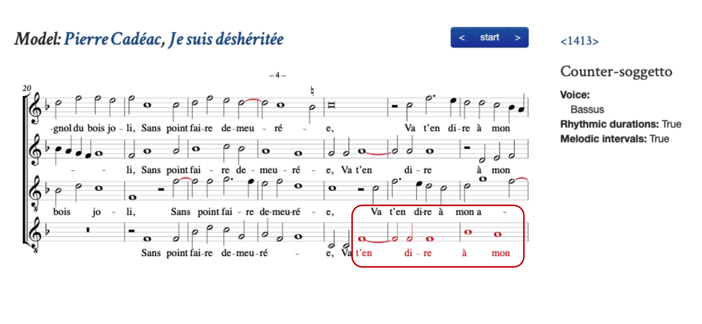

[CRIM Observation 707](https://crimproject.org/observations/707/)

---

## Contrapuntal Duo

Any **pair of voices** in free counterpoint, consisting of soggetto and its countersubject.  

In analysis and data entry, the duo can be characterized by:

* **voices** (“T”, “B”)

**Note**:

* If the **soggetti heard in the duo are *similar* then they form a Fuga**.  More complex forms always supercede simpler ones in CRIM metadata.
* If the **voices are dissimilar, and if the same contrapuntal duo appears more than once**, it is a **Non-Imitative Duo**.

[CRIM Observation 707](https://crimproject.org/observations/707/)

---

## Schubert’s Presentation Types in Brief

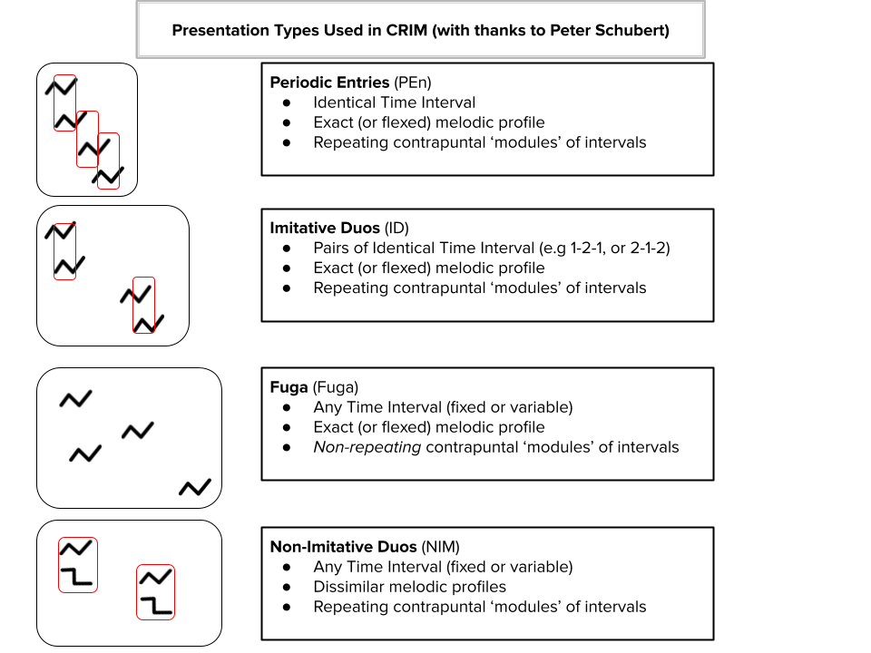

---

## Fuga

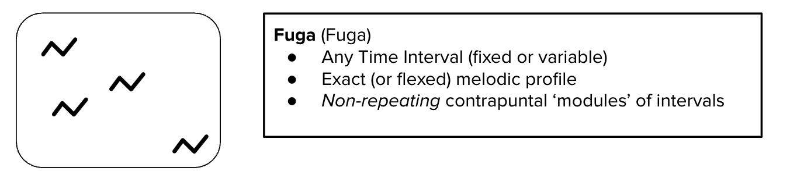

Any set of entries of the same soggetto, but ***without* modular repetition of vertical intervals**. 

Sets involving such modular repetition would instead be I**mitative Duos** or **Periodic Entries**, as explained below.

Modifiers include:

* **Periodic** entries that are *regular* but *without modular repetition* of contrapuntal intervals.
* **Strict** entries are those with identical diatonic melodic intervals.
* **Flexed **entries are those in which melodic or rhythmic contours are similar, but not identical.

In analysis and data entry, the fuga can be characterized by:

* **order of voices** (by staff number, with comma separators, such as “2,1”)
* **intervals of imitative entries** (relative to previous voice, repeated as needed, without separators, for instance:  "8-").  
* **time intervals of entries** (relative to previous voice, counting from first onset; up to but *not including* onset of next voice. Enter slashes between and after each count, but not after letter designating the basic time interval. For instance:  "B1/4/1"  or  "M6/12/6")

---

**Fuga**

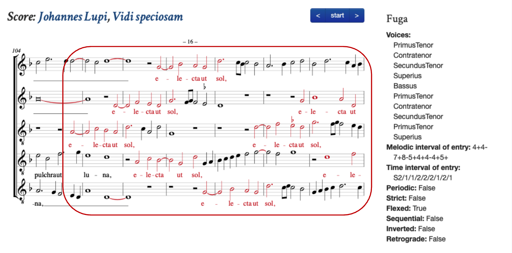

[CRIM Observation 175](https://crimproject.org/observations/175/)

---

**Fuga (Periodic)**

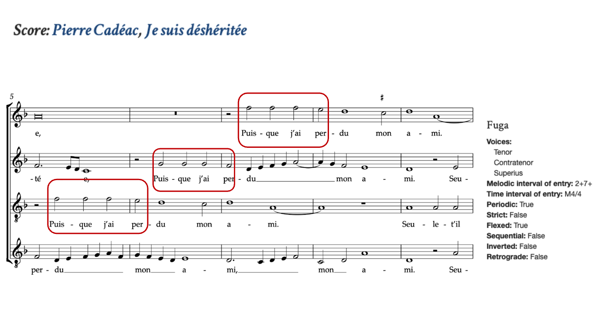

[CRIM Observation 2641](https://crimproject.org/observations/2641/)

---

**Fuga (Strict)**

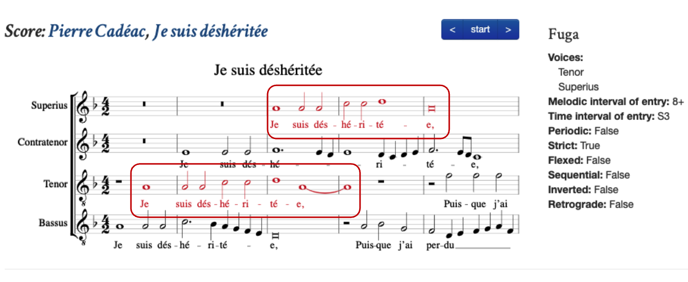

[CRIM Observation 2335](https://crimproject.org/observations/2335/)

---

**Fuga (Flexed)**

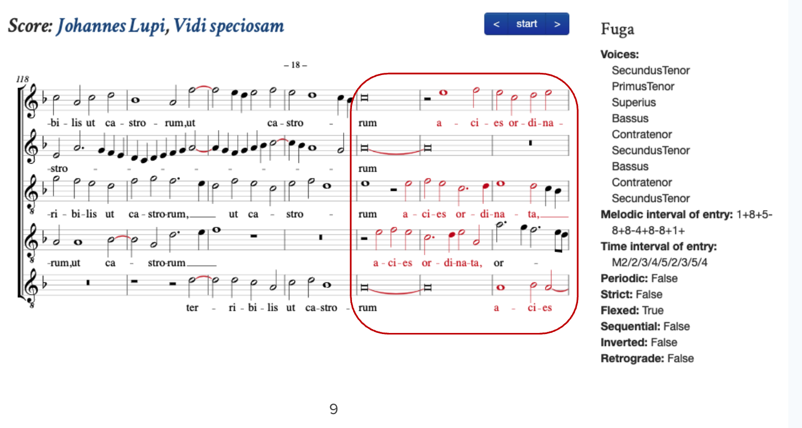

[CRIM Observation 177](https://crimproject.org/observations/177/)

---

## Imitative Duos

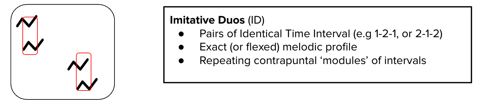

**Two or more Imitative pairs in which the *same soggetto* is heard in each successive voice part.** 

The entries come in sets (at least two, but sometimes more), and thus involve the modular repetition of the same vertical intervals.

Each pair of voices is normally separated by the same vertical and time interval between the imitative entries. 

Successive pairs can follow at longer or shorter time intervals (but if these were the same time interval as within the pairs themselves, the ID would instead be a PEn (see below).

Invertible counterpoint is also possible, but not common in ID

Modifiers include:

* **Strict** entries are those with identical diatonic melodic intervals.
* **Flexed entries** are those in which melodic or rhythmic contours are similar, but not identical.
* **Flexed tonal** entries are those in which the 4ths and 5ths have been exchanged in accordance with modal divisions of the octave. 
* **Invertible counterpoint** (INV)

Note:

* **Strict**, **Flexed**, and **Flexed Tonal** are mutually exclusive

In analysis, the IDs can be characterized by:

* **order of voices** (by staff number, with comma separators:  “3,4,1,2”)
* **intervals of imitative entries** (relative to previous voice, repeated as needed, without separators, for instance:  "8-5+8-")
* **time intervals of entries** (relative to previous voice, counting from first onset; up to but *not including* onset of next voice. Enter slashes between and after each count, but not after letter designating the basic time interval. For instance:  "B1/4/1"  or  "M6/12/6")

**Imitative Duos (strict)**

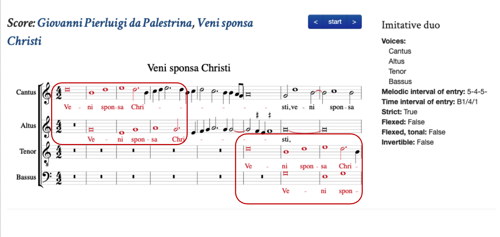

[CRIM Observation 665](https://crimproject.org/observations/665/)

---

**Imitative Duos (flexed)**

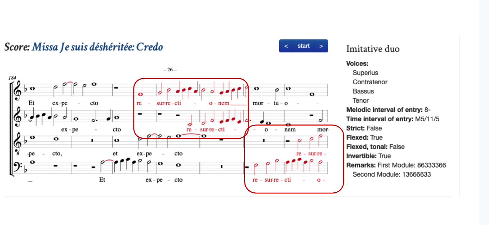

[CRIM Observation 1514](https://crimproject.org/observations/1514/)

---

**Imitative Duos (flexed tonal)**

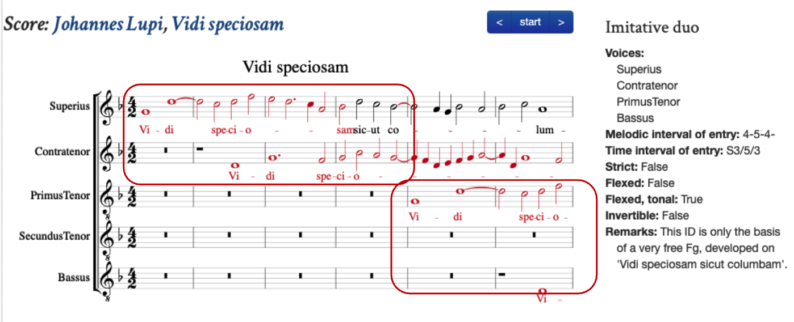

[CRIM Observation 99](https://crimproject.org/observations/99/)

---

**Imitative Duos (invertible counterpoint)**

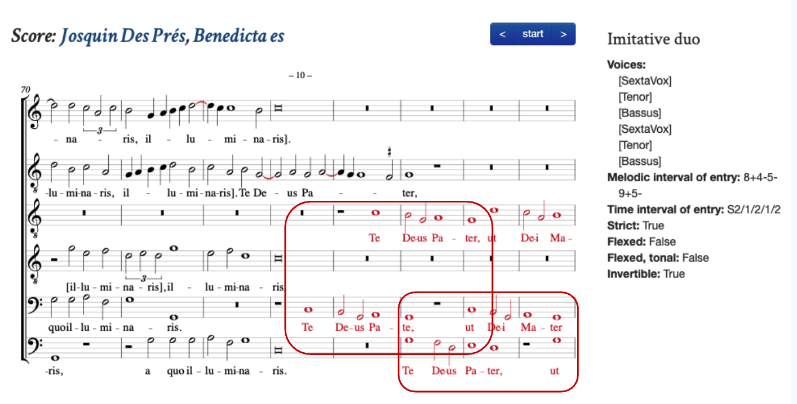

[CRIM Observation 63](https://crimproject.org/observations/63/)

---

## Periodic Entries

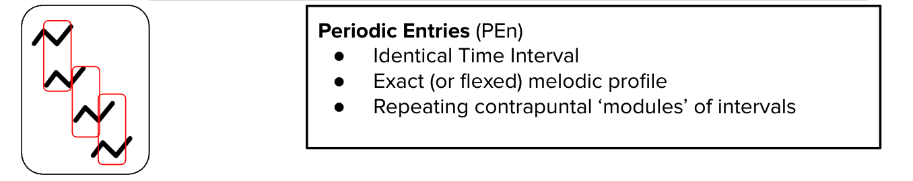

A **regularly-timed series of *at least three entries* of the *same soggetto, where the soggetto is longer than the time interval between entries***. **Each voice enters after the same time interval,** creating modular repetition of the same vertical intervals.  

If there is no overlap between the voices there will be no modular repetition, and thus the pattern is properly a “fuga with periodic entries” (see fuga description above)

**Invertible counterpoint **(INV) is common in PEn, and will result in different (but closely related) successions of vertical intervals.

Modifiers include:

* **Strict** entries are those with identical diatonic melodic intervals.
* **Flexed** entries are those in which melodic or rhythmic contours are similar, but not identical.
* **Flexed tonal **entries are those in which the 4ths and 5ths have been exchanged in accordance with modal divisions of the octave. 
* **Sequential** entries are those that enter on some series of stacked (and thus identical) intervals.
* **Added entries** are used to indicate voices that shares the same soggetto as the PEn, but which complicate the regularity of the pattern. 
    * Added entries sometimes anticipate the main series of the PEn, or interrupt it some way. They are not part of the PEn itself.
* **Invertible counterpoint** (INV)
* Note:
    * Strict, Flexed, and Flexed Tonal are mutually exclusive
    * Strict is compatible with Added Entries, but these are to be mentioned in comments, not the metadata or EMA selection

In analysis and data entry, the PEns can be characterized by:

* **order of voices** (by staff number, with comma separators, “3,4,1”)
* **intervals of imitative entries** (relative to previous voice, repeated as needed, without separators, for instance:  "5-8+")
* **time intervals of entries** (relative to previous voice, counting from first onset; up to but *not including* onset of next voice.  Enter slashes between and after each count, but not after letter designating the basic time interval. For instance:  "B1/4/1"  or  "M6/12/6").  *Do not include added entries in the metadata when marking the pattern as PEn.*

---

**Periodic Entries (strict)**

[CRIM Observation 5057](https://crimproject.org/observations/5057/)

---

**Periodic Entries (invertible counterpoint)**

[CRIM Observation 2613](https://crimproject.org/observations/2613/)

---

**Periodic Entries (sequential)**

[DC0508.7-8. Guyon, Musiciens qui chantez](http://digitalduchemin.org/piece/DC0508)

---

**Periodic Entries (added entries)**

[DC0901.39-43. Gervaise, Je ne cognois](http://digitalduchemin.org/piece/DC0901/)

---

**Periodic Entries (flexed and flexed tonal)**

*For Flexed and Flexed Tonal, see ID and Fuga above.*

---

## Non-Imitative Duos

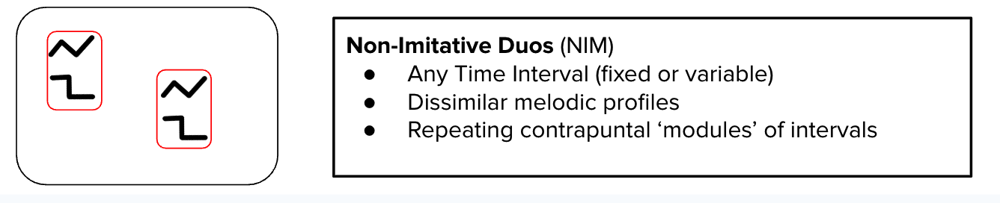

**Non-Imitative Duos** come in sets:  For example:  SA > TB, with the same soggetto in the upper voice of each pair (S and T), but accompanied by a contrasting countersubject in A and B.  Results in repeating “module' of contrapuntal intervals. 

These modules normally repeat at the octave. Two pairs are the norm, but there are often more.  I

It is also possible to have three-voice NIMs.

If the successive sets have *differing* numbers of voices and differing contrapuntal modules, then the pattern is better marked as **HR Dialogue**.

Modifiers include:

* **Strict** entries are those with identical diatonic melodic intervals.
* **Flexed entries** are those in which melodic or rhythmic contours of the corresponding voices (the upper or lower parts of each pair) are similar, but not identical.
* **Flexed tonal** entries are those in which the 4ths and 5ths have been exchanged in accordance with modal divisions of the octave. 
* **Sequential** duos are those that enter on some series of stacked (and thus identical) intervals.
* **Invertible counterpoint** (INV)

Note:

* **Strict**, **Flexed**, and **Flexed Tonal** are mutually exclusive

In analysis and data entry, the duos can be characterized by:

* **order of voices** (in each duo, show voices from high to low, using staff numbers and commas, “1,2,3,4”)
* **intervals of imitative entries** (relative to uppermost voice of previous pair, repeated as needed, without separators, for instance:  "8-", or 8+)
* **time intervals of entries** (relative to *first voice of previous pair*, counting from first onset; up to but *not including* onset of first voice of the next pair. Enter slashes between and after each count, but not after letter designating the basic time interval. For instance:  "B2" or "M4/4")

---

**Non-Imitative Duos (strict)**

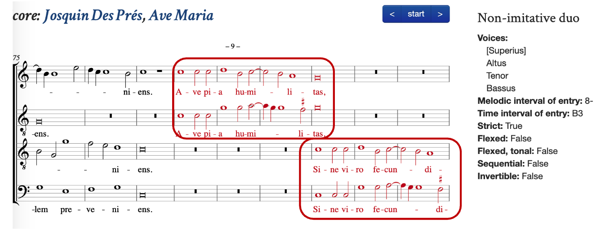

[CRIM Observation 2075](https://crimproject.org/observations/2075/)

---

**Non-Imitative Duos (flexed)**

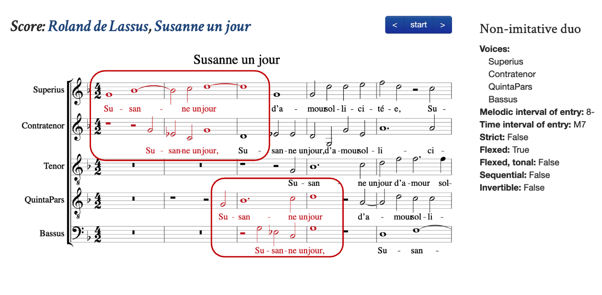

[CRIM Observation 1121](https://crimproject.org/observations/1121/)

---

**Non-Imitative Duos (invertible counterpoint)**

[DC0618.1-4. Marcade, Pour avoir](http://digitalduchemin.org/piece/DC0618/)

---

## Cadences

**Cadences** are normally defined as **octave or unison approach by closest imperfect consonance**.  

The normal voice roles put half-step ascent (the *cantizans*) in the superius and the whole step descent (*tenorizans*) in the tenor. But these roles can exchanged, or played by other voices.

* Cadences usually feature the conventional four-stage model of consonant preparation/syncopated dissonant suspension/resolution/final perfection.  
* Cadences are *not* combined with any other Musical Type.

**Note:**

The **controlled vocabulary** for cadences found in the **CRIM Project** (‘observations’ on crimproject.org) **differ somewhat** from the **cadence labels** used in the **CRIM Intervals **‘piece.cadences()` tool. 

**CRIM Project (Human) Observations** include **Authentic**, **Phrygian**, and **Plagal** types, with various details of **Voice Roles** and **Irregular Motion**

* **Authentic:** a regular cadence in various tonal positions:  to C, D, E, E-flat F, G, A, B-flat, with indication of which voice parts. Begins with first full measure containing the preparation. Note that in the web form we use E-flat and B-flat for those tones.
* **Phrygian:** with 1/2 step in the descending voice. Phrygian cadences in S/T are almost always have *bass motion of falling fourth*, but we do **not** tag Phrygian cadences as plagal!
* **Plagal:**
    * the *absence* of 6-8 motion between any pair of parts
    * the *presence* of parallel 6 motion between two parts and then the bassus falling 4 or rising 5. This *lowest final tone* is used identify the final tone of the cadence.  
    * the *absence* of the 7-6 suspension formula (which nevertheless DOES appear in Phrygian cadences, which also involve bassus falling 4 or rising 5)
    * The optional presence of 4-3 or even 6-5/4-3 double suspensions Plagal half-cadence is not something that be defined in any objective way, but it can certainly be part of narrative arguments about borrowings or similarity.
* **Voice Roles** are indicated with numbers in the relevant box
* **Final Tone** Is the octave or unison reached by cantizans and tenorizans. In case of Plagal use the lowest tone of the ensemble.
* **Dovetail** **voice**: the voice in which the next soggetto or line of text begins, even as the current cadence is coming to a conclusion. Normally enters on a tone that is a fifth above the **final of the cadence**.  In CRIM we are interested in whether this dovetail voice appears ***above, between, or below the cadential pair*** formed by the cantizans and tenorizans.
* **Irregular Cadences **(can be added in any combination to the above categories)
        * We consider as irregular **any cadence in which one or more of the voice roles move in an unexpected way**.  This includes situations in which a voice is suddenly *silent*, or moves in the wrong direction (as when the tenorizans moves up instead of down, or the bassus leaps up a third instead of falling a fifth).  Since the voice roles are already indicated in the choice of Cantizans and Tenorizans in the main cadence data, we need only note which “roles” move irregularly. 

**CRIM Intervals (Machine) Predictions** do **NOT include Plagal types**.  But they do distinguish among:

* **Clausula Vera** is for cadences involving only Cantizans and Tenorizans, which move via suspension formula to unison or octave;
* **Authentic** is for Cantizans and Bassizans (and possibly the Tenorizans, too); check the CVFs cadential voice functions to see if the Tenorizans is present.
* **Phrygian Clausula Vera** is like Clausula Vera but with the half-step motion in the downward-moving (Tenorizans) part.
* **Phrygian** corresponds to Authentic, except that the Bassizans of course moves up a fifth or down a fourth, as is normally the case when the Tenorizans descends by half-step. Check the Cadential Voice Functions (CVFs) in the output table to see whether the Tenorizans is present.
* **Altizans Only** is in cases where the Cantizans is missing and the Altizans role moves to a fifth above the lowest voice.
* **Double Leading Tone** is heard frequently in fifteenth-century repertories, but rarely in the sixteenth century; the Contratenor voice sits between the Tenorizans and Cantizans, moving in parallel fourths with the latter and arriving at a tone a fifth above the final. In order to avoid a tritone between it and the Cantizans, it moves by half step, thus producing the 'double leading tone' effect.
* **Leaping Contratenor **is another relatively antique type found mostly in fifteenth century compositions.  The contratenor leaps up an octave to arrive at a tone a fifth above the cadence final, which is heard in the tenor part.
* **Quince** is best understood as an irregular Clausula Vera, but the Tenorizans part leaps down a fifth to end on a tone a fifth above the final in the Canitzans. Hence the name: "Quince".
* **Irregular Cadences**:  **Evaded and Abandoned** indicate either irregular motion or some number of voices that drop out. These are noted for Clausula Vera, Authentic, and Double Leading Tone types

    **CRIM Intervals Predictions** also include a great deal of detail about the context of each cadence.  Read more about the `piece.cadences()` tool in the [CRIM Intervals Documentation](https://github.com/HCDigitalScholarship/intervals/blob/main/tutorial/11_Cadences.md).

    There is also a `linkExample()` tool that allows us to view the results in automated score annotations. Read more about the tool in the [CRIM Intervals Documentation](https://github.com/HCDigitalScholarship/intervals/blob/main/tutorial/13_Musical_Examples_Verovio.md#5--print-with-analytic-highlights).

---

### CRIM Project Cadence Observation Examples 

**Cadence (authentic) to C**

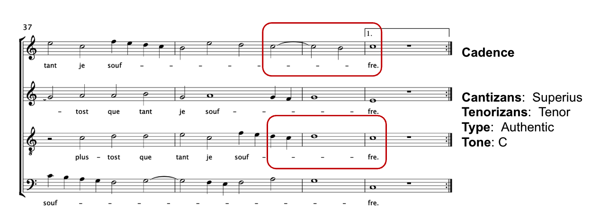

[DC0519.40-41. L’huillier, Si je te voy](http://digitalduchemin.org/piece/DC0519/)

---

**Cadence (authentic) to D**

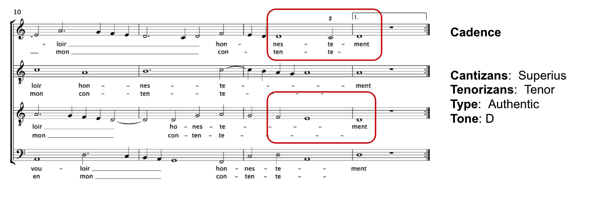

[DC0101.12.13. Certon, Qui souhaitez avoir](http://digitalduchemin.org/piece/DC0101/)

---

**Cadence (authentic) to F**

[DC0119.31.32. Du Tertre, J’ay d’un costé](http://digitalduchemin.org/piece/DC0119/)

---

**Cadence (authentic) to G**

[DC0502.14-15. Godart, J’ay le fruict desiré](http://digitalduchemin.org/piece/DC0502/)

---

**Cadence (authentic) to A**

[DC0101.6-7. Certon, Qui souhaitez avoir](http://digitalduchemin.org/piece/DC0101/)

---

**Cadence (authentic) to B-flat**

[DC0104.3-4. Le Gendre, Cherchant amour](http://digitalduchemin.org/piece/DC0104/)

---

**Cadence (phrygian) to E**

[DC0114.22-23. Pagnier, Trop justement](http://digitalduchemin.org/piece/DC0114/)

---

**Cadence (phrygian) to D**

[DC0108.4-6. De Marle, Vivre sera](http://digitalduchemin.org/piece/DC0108/)

---

**Cadence (phrygian) to A**

[DC0106.23-24.Certon, L’enfant amour](http://digitalduchemin.org/piece/DC0106/)

---

**Cadence (plagal) to D**

[DC0502.19-20. Godart, J’ay le fruict desiré](http://digitalduchemin.org/piece/DC0502/)

---

**Cadence (plagal) to C**

[DC0122.5-6. de Villiers, Amour et mort](http://digitalduchemin.org/piece/DC0122/)

---

**Cadence (dovetail voice)**

[DC0303.19-20. Guilliaud, Si mon grand mal](http://digitalduchemin.org/piece/DC0303/)

---

**Cadence (irregular)**

[DC0102.24-25. Regnes, Venons au poinct](http://digitalduchemin.org/piece/DC0102/)

---

**Cadence (irregular)**

[DC0102.24-25. Regnes, Venons au poinct](http://digitalduchemin.org/piece/DC0102/)

---

**Cadence (irregular)**

[DC0303.23-28. Guilliaud, Si mon grand mal](http://digitalduchemin.org/piece/DC0303/)

---

### CRIM Intervals Cadence Prediction Examples 

**Cadence (clausula vera)**

[Clemens non Papa, Au joli boquet DC0916, mm. 12-13](https://digitalduchemin.org/piece/DC0916/)

---

**Cadence (authentic)**

[Le Gendre, J’ay bien DC1010, mm. 44-45](https://digitalduchemin.org/piece/DC1010)

---

**Cadence (Phrygian Clausula vera)**

[Anon, Jehan se jouet, DC 0521, mm. 14-15](https://digitalduchemin.org/piece/DC0521)

---

**Cadence (Phrygian)**

[Pierre Certon, Vostre beaulté DC 1107, mm. 36-37](https://digitalduchemin.org/piece/DC1107)

---

**Cadence (Altizans only)**

[Thomas Crecquillon, Taire, et souffrir DC 1121 mm. 36-37](https://digitalduchemin.org/piece/DC1121)

---

**Cadence (Double Leading Tone)**

[Gilles Binchois, Tout à par moy, Leuven Chansonnier 27, mm. 7-8](https://www.diamm.ac.uk/sources/4735/#/inventory)

---

**Cadence (Leaping Contratenor)**

[Antoine Busnoys, Le corps s'en va, Leuven Chansonnier 29, mm. 11-12](https://www.diamm.ac.uk/sources/4735/#/inventory)

---

**Cadence (Evaded)**

[Nicolas Pagnier, Elle disoit DC0306, mm. 20-21](https://digitalduchemin.org/piece/DC0306)

---

## Homorhythm

**Homorhythm** is when three or more voices present the text in more or less simultaneous durations. 

Modifiers include:

* **Simple** (**HR**=default):  Three (or more) voices in coordinated presentation of the text, in the same (or almost exactly the same) rhythm.
* **Staggered** or ruffled homorhythm (**HR-S**):  three (or four) voices moving in strict coordination but a fourth (or fifth) enters in slightly before or after them.  
* **Sequential** (**HR-Sq**): Sequential HR patterns that enter on some series of stacked (and thus identical) diatonic intervals.
* **Fauxbourdon** (**HR-F**): three voices moving in parallel 63 sonorities (an archaism)
* **Dialogue** (**HR-D**): The *repetition* of some HR forms involving more than two voices but between which there are *no repeating modules*.  If there are repeating contrapuntal modules, the pattern should be marked as NIM.

Note:

* The various types of HR are *mutually incompatible, except for HR Dialogue*, which can be used in conjunction with any of the others.

In analysis and data entry, the HR patterns can be characterized by:

* voices (all voices that participate, top to bottom, using staff numbers with comma separators.  Ex:  "1,2,3,4")

---

**Homorhythm (simple)**

[CRIM Observation 2625](https://crimproject.org/observations/2625/)

---

**Homorhythm (staggered)**

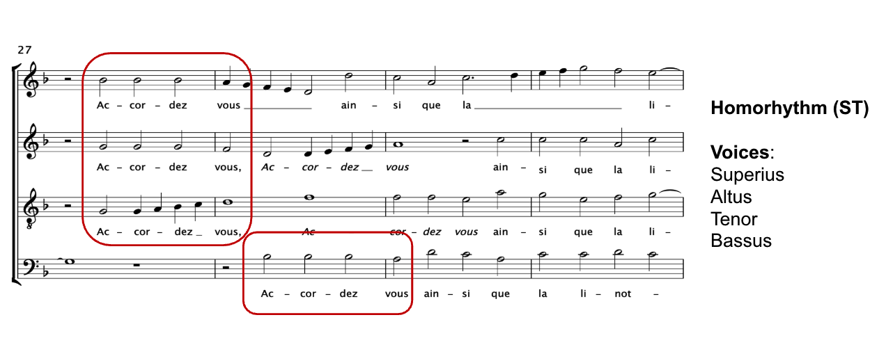

[DC0508.27-28. Guyon, Musiciens qui chantez](http://digitalduchemin.org/piece/DC0508/)

---

**Homorhythm (fauxbourdon)**

[DC0905.21-22. Archadelt, Je ne suis pas](http://digitalduchemin.org/piece/DC0905/)

