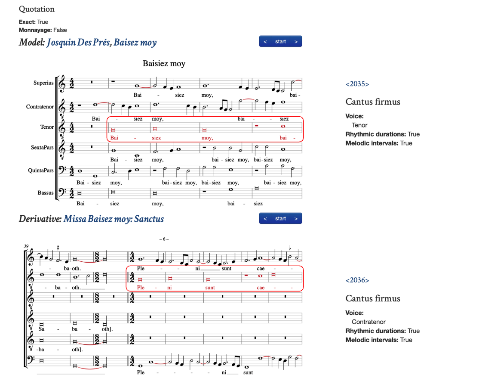
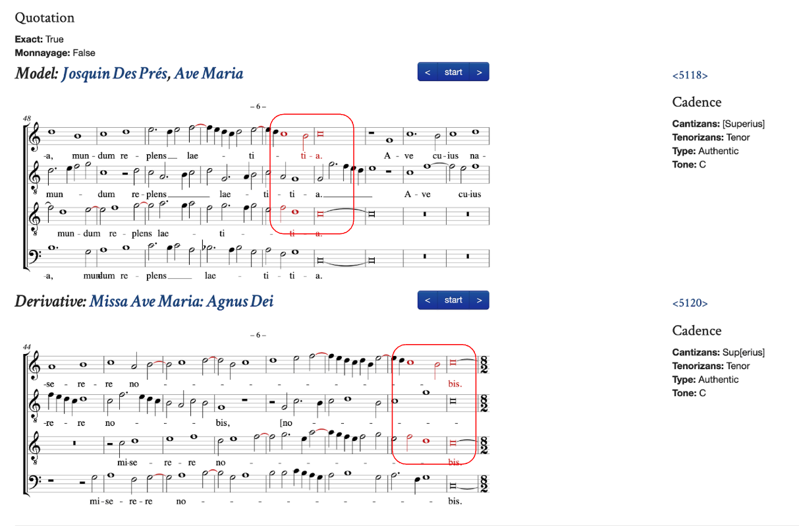
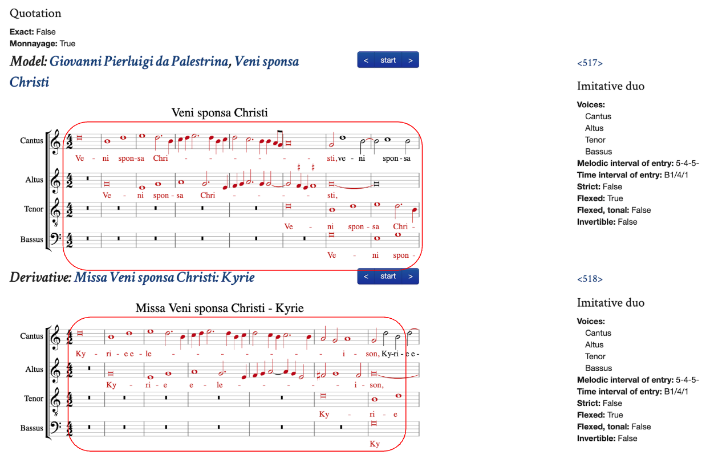
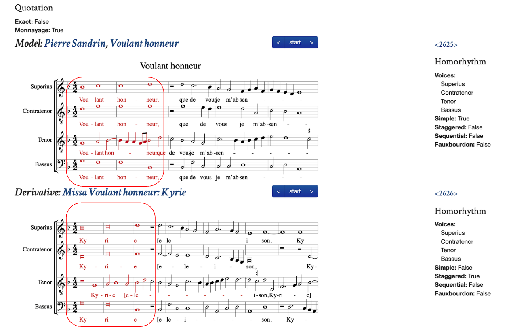
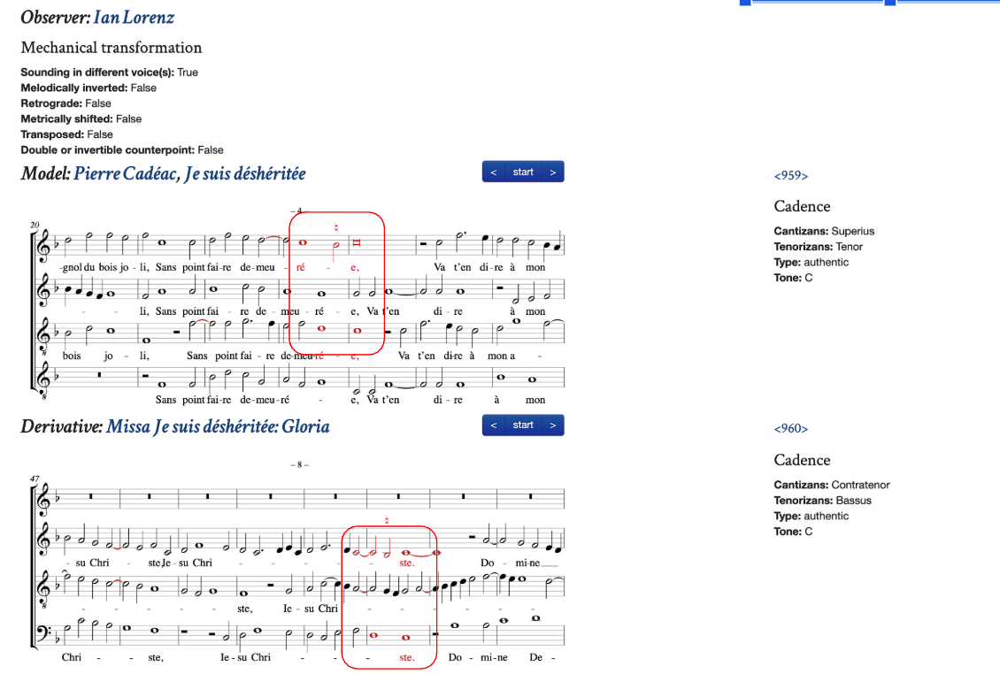
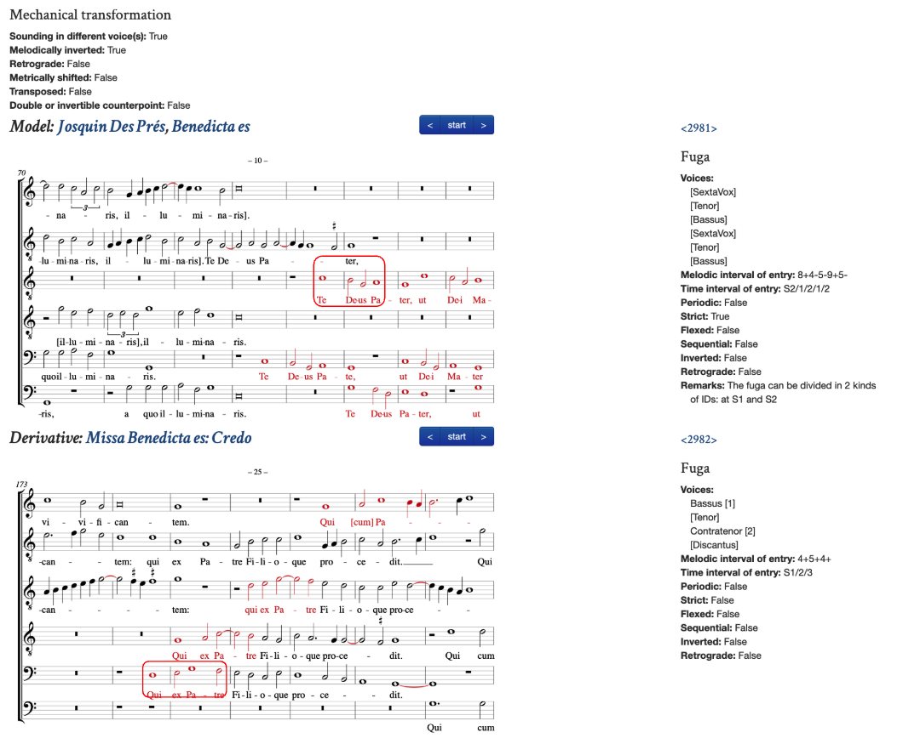
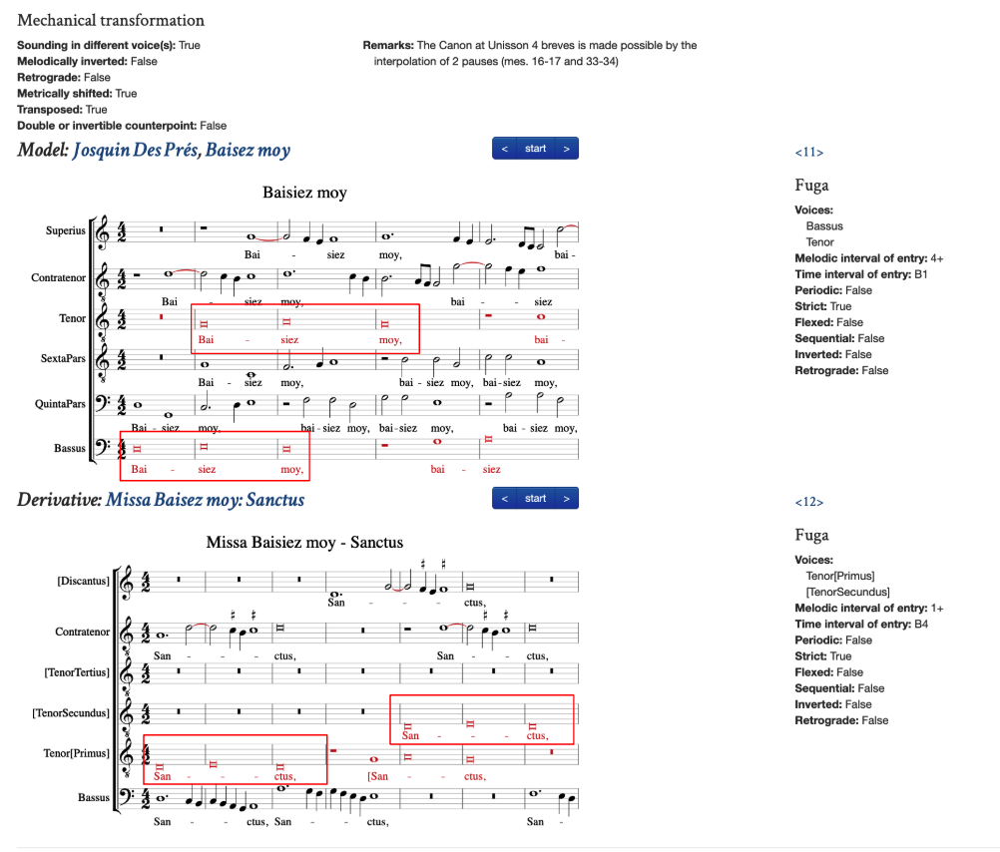
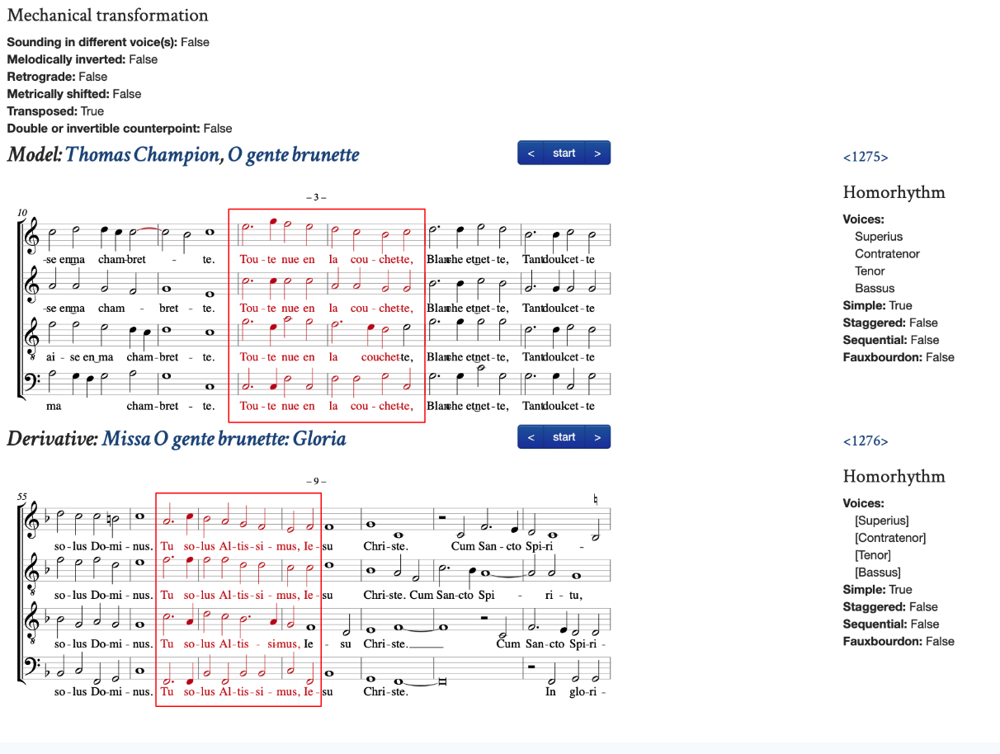

# Citations: the Renaissance Imitation Mass

Updated April 2025

# Relationship Types

## Table of Contents

* [Relationship Types](#relationship-types)
* [Quotation (Exact)](#quotation-exact)
* [Quotation (Monnayage)](#quotation-monnayage)
* [Transformation (Mechanical)](#transformation-mechanical)
* [Transformation (Non-Mechanical)](#transformation-non-mechanical)
* [Omission](#omission)
* [New Material](#new-material)
* [Self](#self)

##  Relationship Types

These are the basic categories of relationships between Masses and Models. They describe the treatment of various elements from the [Thesaurus of Musical Types](https://github.com/CRIM-Project/CRIM-online/blob/master/CRIM_Musical_Types_Thesaurus.md)

## Quotation (Exact)

1.  **Quotation Exact** is an exact copy (in all ways), and could involve a

* **soggetto** (even if subsequently there is some elaboration of the same idea)
* **contrapuntal pair** (including NIMs, etc)
* **fuga/imitation** (including IDs, PEn's etc)
* **homorhythmic block**
* **cadence**

    The **[Self]** types are also available in **Quotation (Exact)**.

---

**Quotation (exact in all ways)**

[CRIM Relationship 1018](http://crimproject.org/relationships/1018/)

---

**Quotation (exact in all ways)**

[CRIM Relationship 2628](http://crimproject.org/relationships/2628/)

---

## Quotation (Monnayage)

2.  **Monnayage is minimal variation**  . . .

via the “exchange” of pitches or rhythmic values, without meaningful lengthening or shortening of the musical idea.

The concept also applies to minimal variation of contrapuntal combinations or cadences.

Thus **Quotation (Monnayage)** can be applied in the same way as **Quotation (Exact)**

* **soggetto** (even if subsequently there is some elaboration of the same idea)
* **contrapuntal pair** (including NIMs, etc)
* **fuga/imitation** (including IDs, PEn's etc)
* **homorhythmic block	**
* **cadence**

The **Self** types are also available in **Quotation (Monnayage)**.

---

**Quotation (Monnayage)**

[CRIM Relationship 259](http://crimproject.org/relationships/259/)

---

**Quotation (Monnayage)**

[CRIM Relationship 1313](http://crimproject.org/relationships/1313/)

---

## Transformation  (Mechanical)

**In Transformation  (Mechanical) all elements are globally changed)**

Passages in which all elements are **globally and systematically changed but not otherwise embellished, amplified, etc., **including:

* ***sounding in different voice(s)*** = change of voice role, *but otherwise varied*
* ***melodically inverted*** (that is, the inversion of something in the model)
* ***retrograde*** (the reversal of something the model)
* ***metrically shifted*** (counterpoint was at time interval A, now at time interval B)
* ***not transposed***, ***transposed***, or ***transposed*** ***different amounts*** (double or invertible cpt)
* ***systematic diminution*** (and otherwise *unvaried*, as when a soggetto is subject to a mensural change)
* ***systematic augmentation*** (and otherwise *unvaried*, as when a soggetto is subject to a mensural change)

These can be combined in the webform in the *same* Relationship, or could be recorded in *separate* Relationships.

The **Self** types are also available in **Transformation (Mechanical)**

---

**Transformation  (Mechanical)**

**sounding in different voice(s)** = change of voice role

[CRIM Relationship 480](http://crimproject.org/relationships/480/)

---

**Transformation  (Mechanical)**

**melodically inverted**

[CRIM Relationship 1491](http://crimproject.org/relationships/1491/)

---

**Transformation  (Mechanical)**

**metrically shifted** (counterpoint was at time interval A, now at time interval B)

[CRIM Relationship 6](http://crimproject.org/relationships/6)

---

**Transformation  (Mechanical)**

**transposed**

[CRIM Relationship 638](http://crimproject.org/relationships/638/)

---

**Transformation (Mechanical)**

**transposed different amounts** (double or invertible cpt)

[CRIM Relationship 2475](http://crimproject.org/relationships/2475/)

---

## Transformation (Non-Mechanical)

Passages in which any or all elements are **changed in complex rather than systematic ways**.  

**Activity**, **Extent**, and **Contrapuntal Variation** can all be combined as needed.

**Extent**(the following two options are *mutually exclusive*)

* ***amplified*** (through internal repetition of a motive, or the repetition and extension of a presentation type) 
* ***truncated*** (as when a melodic phrase has shortened or interrupted, or when a presentation type is abbreviated)

**Activity**(the following two options are *mutually exclusive*)

* ***embellished*** (or allusive, with passing or other decorative tones added to a melody)
* ***reduced*** (as when only certain ‘structural’ tones have been retained, or some repetition eliminated from a melody. This could also include other kinds of melodic or motivic interruption or truncation.)

**Contrapuntal Variation** (the following can be used in any combination)

* ***sounding in different voices*** (in combination with one of the complex variations noted above)
* ***whole passage transposed*** (in combination with one of the complex variations noted above)
* ***whole passage metrically shifted*** (in combination with one of the complex variations noted above)
* ***melodically inverted*** (in combination with one of the complex variations noted above)
* ***retrograde*** (in combination with one of the complex variations noted above)
* having ***new counter subject*** (as when a soggetto from an imitative duet is used a non-imitative duet)
* ***old counter subject is shifted metrically*** (could also include change of voice role)
* ***old counter subject is transposed*** by some interval (could include change of voice role)
* ***double or invertible counterpoint***  (in combination with one of the complex variations noted above)
* some ***new combination*** (as when two independent soggetti have now been combined to make a presentation type)

The **[Self]** types are also available in **Transformation (Non-Mechanical)**.

These *attributes* of the given passage are added to the Relationship *via* the webform.

---

**Transformation (Non-Mechanical)**

**Extent:   Amplified**

[Crim Relationship 2601](http://crimproject.org/relationships/2601/)

---

**Transformation (Non-Mechanical)**

**Extent:  Truncated**

[Crim Relationship 168](http://crimproject.org/relationships/168/?pd=19#score)

---

**Transformation (Non-Mechanical)**

**Activity: Embellished** (or allusive, with passing or other decorative tones added)

[CRIM Relationship 366](http://crimproject.org/relationships/366/)

---

**Transformation (Non-Mechanical)**

**Activity: Reduced**

[Crim Relationship 157](http://crimproject.org/relationships/157/)

---

**Transformation (Non-Mechanical)**

**Contrapuntal Variation:  New Counter Subject**

[Crim Relationship 2460](http://crimproject.org/relationships/2640)

---

**Transformation (Non-Mechanical)**

**Contrapuntal Variation: Old Counter-Subject Shifted and Transposed**

[Crim Relationship 96](http://crimproject.org/relationships/96)

---

**Transformation (Non-Mechanical)**

**Contrapuntal Variation: New Combination**

[Crim Relationship 1218](http://crimproject.org/relationships/1218)

---

## Omission

The **omission** of important musical material heard in the **Model** but not heard in the derivative..  In the **derivative**, the site where the **Omitted** material seems would most logically have been heard is marked by the selection of **one full measure** in the uppermost voice. If it’s not clear where the omission would have been heard, we use the first full measure of the derivative.

---

**Omission**

[Crim Relationship 830](https://crimproject.org/relationships/830/)

---

## New Material

The insertion of **new musica**l material via entirely new soggetti or patterns.  In the **Model**, the site where the **New Material **seems to be inserted is marked by the selection of **one full measure** in the uppermost voice.

If such material is subsequently repeated later in the same Mass, it could be a form of Quotation or Transformation. 

---

**New Material**

[Crim Relationship 123](https://crimproject.org/relationships/123/)

### Self

All Relationship types normally involve a *Model* and a *Derivative*.

The **Self** types, however, allow users to note the different ways in which material is developed, repeated, or recalled during a **single composition or movement**. These should not be confused with any of the Presentation Types that are themselves forms of modular repetition!

Self relations can be used for **Quotation**, **Mechanical Transformation**, and **Non-Mechanical Transformation** a Relationship can involve two Observations from the *same* work. In such cases we use **Self Enchainment** / **Self Repetition** / **Self Return **as part of the regular data entry for those categories. Make TWO observations in the usual way using the same work as both “model” and “derivative. Chose appropriate musical types for each observation.

If the Relationship in question in question involves *two different works*, then simply indicate **None** for the “self” type. This is the default.

---

**Self**

**Self-Enchainment**:  the **immediate transformation** of a pattern ***within the same piece.***

---

**Self**

**Self-Enchainment**:  the **immediate transformation** of a pattern ***within the same piece.***

---

**Self**

**Self-Return**:  the **reprise of a pattern** heard ***earlier*** ***in the same movement or piece.***

[Crim Relationship 2245](http://crimproject.org/relationships/2245)
